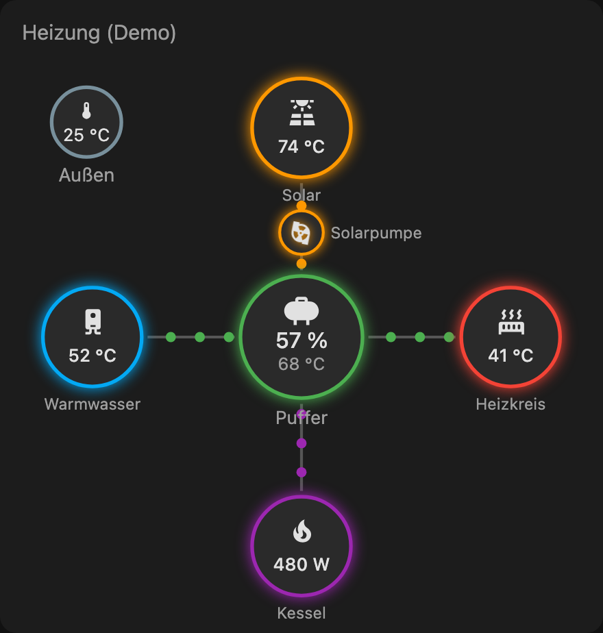

# ETA Flow Card

[![hacs][hacs-badge]][hacs-url]
[![release][release-badge]][release-url]
![license][license-badge]

An animated heat-flow card for [Home Assistant][ha] that visualizes an
**ETA pellet heating** system — glowing nodes and flowing dots showing heat moving between
the boiler, buffer tank, solar collectors, hot water and heating circuits.

Inspired by the look of [`power-flow-card-plus`][pfcp], but for heat instead of electricity.

<p align="center">
  
</p>

## ⚠️ Prerequisite: the ETA sensor integration

**This card does not talk to your heating system.** It only *visualizes* entities that
already exist in Home Assistant. You must first install an integration that exposes your
ETA data as sensors:

👉 **[Tidone/homeassistant_eta_integration][eta-integration]** (recommended)

Once that integration is set up and you have entities like `sensor.eta_puffer_...`,
`sensor.eta_kessel_...`, etc., this card can draw them.

## Features

- Radial layout with the **Puffer** (buffer tank) as the central hub.
- Nodes for **Kessel** (boiler), **Solar**, **Warmwasser** (DHW), **Heizkreis**
  (heating circuit), and an **Außentemperatur** corner badge.
- A dedicated **Solarpumpe** glyph that spins while the solar pump runs.
- Animated flow dots on each connection; **speed and direction driven per edge** by a
  power sensor, a pump/on-off state, or a temperature difference.
- Nodes you don't configure are hidden, so it adapts to simpler setups.
- Graphical editor for mapping node entities (edges via YAML).

## Installation

### Option 1 — HACS (recommended)

1. In HACS, open the ⋮ menu → **Custom repositories**.
2. Add `https://github.com/orazefabian/eta-flow` with category **Dashboard**.
3. Search for **ETA Flow Card** and download it.
4. HACS adds the Lovelace resource automatically. (Reload your browser if the card
   doesn't appear yet.)

### Option 2 — Manual

1. Download `eta-flow-card.js` from the [latest release][release-url].
2. Copy it to `config/www/eta-flow-card.js`.
3. Add it as a resource: **Settings → Dashboards → ⋮ → Resources → Add resource**
   - URL: `/local/eta-flow-card.js`
   - Type: **JavaScript Module**

## Configuration

Add a **Manual card** and paste the YAML below, or use the graphical editor to map the
node entities. Every `nodes` and `edges` entry is optional.

```yaml
type: custom:eta-flow-card
title: Heizung
nodes:
  puffer:
    primary: sensor.eta_puffer_ladezustand # e.g. %
    secondary: sensor.eta_puffer_temp_oben # optional, e.g. °C
  kessel:
    primary: sensor.eta_kessel_leistung
  solar:
    primary: sensor.eta_solar_kollektor_temp
  warmwasser:
    primary: sensor.eta_warmwasser_temp
  heizkreis:
    primary: sensor.eta_heizkreis_vorlauf_temp
  aussen:
    primary: sensor.eta_aussentemperatur # rendered as a corner badge
edges:
  solar_to_puffer:
    type: state
    entity: binary_sensor.eta_solarpumpe
    active_states: ["on"]
  kessel_to_puffer:
    type: power
    entity: sensor.eta_kessel_leistung
  puffer_to_warmwasser:
    type: delta
    from_entity: sensor.eta_puffer_temp_oben
    to_entity: sensor.eta_warmwasser_temp
  puffer_to_heizkreis:
    type: state
    entity: binary_sensor.eta_heizkreis_pumpe
    active_states: ["on"]
solarpumpe:
  entity: binary_sensor.eta_solarpumpe
```

### Nodes

| Key          | Position       | Typical value          |
| ------------ | -------------- | ---------------------- |
| `puffer`     | center (hub)   | charge % / temperature |
| `solar`      | top            | collector temperature  |
| `kessel`     | bottom         | output % / temperature |
| `warmwasser` | left           | DHW temperature        |
| `heizkreis`  | right          | flow temperature       |
| `aussen`     | corner badge   | outside temperature    |

Every node is fully customizable:

| Option         | Description                                                              |
| -------------- | ------------------------------------------------------------------------ |
| `primary`      | entity shown as the big value (with its unit)                            |
| `secondary`    | optional entity shown as a smaller value below                           |
| `name`         | override the label under the circle                                      |
| `icon`         | override the mdi icon (shown above the value)                            |
| `color`        | ring / flow accent color                                                 |
| `radius`       | circle size in canvas units (≈ % of card width; e.g. `34`), default per role |
| `stroke_width` | outline thickness (default `2.5`)                                        |

The `solarpumpe` glyph (shown on the Solar↔Puffer line) supports `entity`, `active_states`,
`name`, `icon`, `color`, and `hide_label`.

### Edges

Dots travel `from → to` when active. The four edge keys are fixed:
`solar_to_puffer`, `kessel_to_puffer`, `puffer_to_warmwasser`, `puffer_to_heizkreis`.

| `type`  | Active when…                                   | Fields                          |
| ------- | ---------------------------------------------- | ------------------------------- |
| `power` | numeric `entity` magnitude > `threshold`       | `entity`, `threshold`, `invert` |
| `state` | `entity` state is in `active_states`           | `entity`, `active_states`       |
| `delta` | `from_entity` warmer than `to_entity`          | `from_entity`, `to_entity`, `threshold` |

For `type: power`, a negative value reverses the dot direction; `invert: true` flips it.

## Development

```bash
scripts/setup     # install dependencies
scripts/develop   # rollup --watch → dist/eta-flow-card.js
scripts/lint      # eslint + prettier + tsc
npm run demo      # build + serve a local mock preview (no Home Assistant needed)
```

`npm run demo` starts a static server at <http://localhost:8080/demo/> that renders the
card against mock ETA data, with sliders/toggles to preview how nodes light up and flow
dots react. See [CONTRIBUTING.md](CONTRIBUTING.md).

## Disclaimer

Not affiliated with, endorsed by, or connected to ETA Heiztechnik GmbH. "ETA" is used only
to describe compatibility. Provided as-is under the [MIT License](LICENSE).

<!-- badges -->
[hacs-badge]: https://img.shields.io/badge/HACS-Custom-41BDF5.svg
[hacs-url]: https://github.com/orazefabian/eta-flow
[release-badge]: https://img.shields.io/github/v/release/orazefabian/eta-flow
[release-url]: https://github.com/orazefabian/eta-flow/releases
[license-badge]: https://img.shields.io/github/license/orazefabian/eta-flow
[ha]: https://www.home-assistant.io/
[pfcp]: https://github.com/flixlix/power-flow-card-plus
[eta-integration]: https://github.com/Tidone/homeassistant_eta_integration
